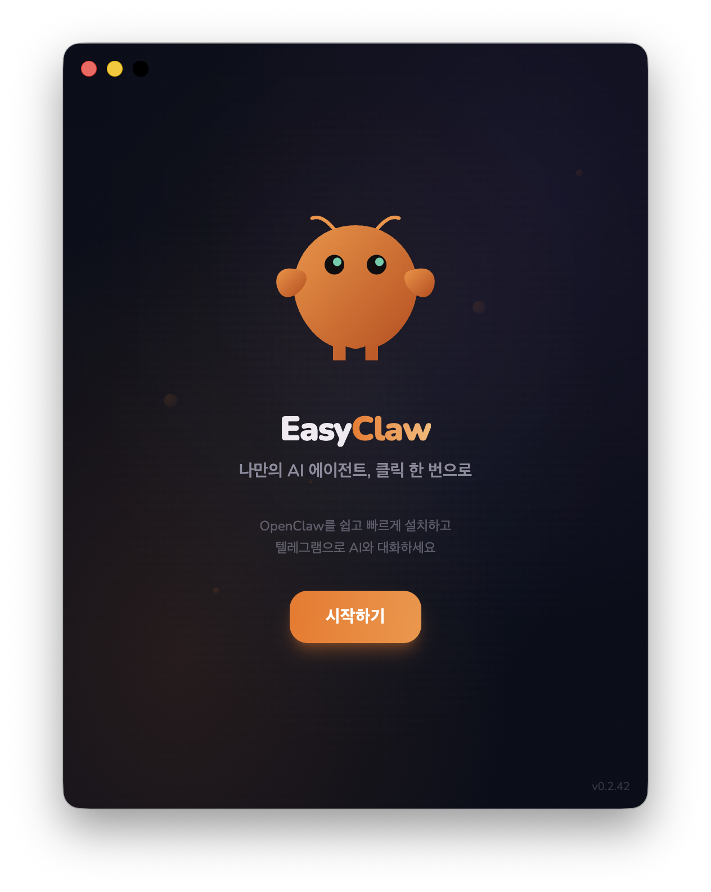

<p align="center">
  
</p>

<h1 align="center">VoidClaw</h1>

<p align="center">
  <strong>OpenClaw AI 에이전트를 원클릭으로 설치하세요</strong>
</p>

<p align="center">
  <a href="README.md">English</a> · <a href="README.ja.md">日本語</a> · <a href="README.zh.md">中文</a>
</p>

<p align="center">
  <a href="https://github.com/VoidLight00/voidclaw/releases/latest"></a>
  <a href="https://github.com/VoidLight00/voidclaw/releases"></a>
  
  <a href="LICENSE"></a>
</p>

<p align="center">
  <a href="https://github.com/VoidLight00/voidclaw/releases/latest">다운로드</a> · <a href="https://github.com/openclaw/openclaw">OpenClaw</a>
</p>

---

<p align="center">
  
  &nbsp;&nbsp;
  
  &nbsp;&nbsp;
  
</p>

## 소개

[OpenClaw](https://github.com/openclaw/openclaw) AI 에이전트를 **복잡한 터미널 작업 없이** 설치할 수 있는 데스크톱 인스톨러입니다.

**다운로드 → 실행 → 로그인**, 3단계면 끝.

---

## ✨ 이지클로에서 업그레이드된 점

VoidClaw는 이지클로(EasyClaw)를 기반으로 전면 재설계된 버전입니다.

| 항목 | 이지클로 | **VoidClaw** |
| ---- | :------: | :----------: |
| 설치 위자드 | 7단계 | **5단계로 간소화** |
| AI 로그인 | API 키 직접 입력 | **🔑 OAuth 원클릭 로그인** |
| 에이전트 개인화 | ❌ | **✅ SOUL.md / USER.md / IDENTITY.md 자동 생성** |
| 텔레그램 봇 검증 | ❌ | **✅ 토큰 실시간 검증** |
| 에이전트 이름/성격 설정 | ❌ | **✅ 설치 중 바로 설정** |

> API 키를 직접 발급받고 입력하는 번거로움 없이, 버튼 하나로 로그인하세요.

---

## 주요 기능

- **원클릭 설치** — WSL, Node.js, OpenClaw 등 필요한 환경을 자동 감지 및 설치
- **OAuth 로그인** — API 키 없이 Anthropic, Google Gemini, OpenAI, Qwen 원클릭 인증
- **에이전트 개인화** — 이름·성격·사용자 정보를 설치 과정에서 바로 설정
- **텔레그램 연동** — 텔레그램 봇을 통해 어디서든 AI 에이전트 사용
- **크로스 플랫폼** — macOS (Intel + Apple Silicon) / Windows 지원

## 다운로드

| OS      | 파일   | 링크                                                                                          |
| ------- | ------ | --------------------------------------------------------------------------------------------- |
| macOS   | `.dmg` | [다운로드](https://github.com/VoidLight00/voidclaw/releases/latest/download/voidclaw.dmg)       |
| Windows | `.exe` | [다운로드](https://github.com/VoidLight00/voidclaw/releases/latest/download/voidclaw-setup.exe) |

## Windows 보안 경고 안내

Windows 코드 서명 인증서 발급을 진행 중입니다. 현재는 설치 시 보안 경고가 나타날 수 있습니다.

> - [VirusTotal 검사 결과](https://www.virustotal.com/gui/url/800de679ba1d63c29023776989a531d27c4510666a320ae3b440c7785b2ab149) — 94개 백신 엔진에서 탐지 0건
> - 소스코드 전체 공개 — 누구나 코드를 직접 검증 가능
> - GitHub Actions CI/CD로 빌드 — 빌드 과정이 투명하게 공개

<details>
<summary><b>"Windows의 PC 보호" 경고가 나타나면</b></summary>

1. **"추가 정보"** 클릭
2. **"실행"** 클릭

</details>

## 기술 스택

| 영역       | 기술                                                     |
| ---------- | -------------------------------------------------------- |
| 프레임워크 | Electron + electron-vite                                 |
| 프론트엔드 | React 19 + Tailwind CSS 4                                |
| 언어       | TypeScript                                               |
| 빌드/배포  | electron-builder + GitHub Actions                        |
| 코드 서명  | Apple Notarization (macOS) / SignPath (Windows, 진행 중) |

## 개발

```bash
npm install    # 의존성 설치
npm run dev    # 개발 모드 (electron-vite dev)
npm run build  # 타입 체크 + 빌드
npm run lint   # ESLint
npm run format # Prettier
```

플랫폼별 패키징:

```bash
npm run build:mac-local  # macOS 로컬 빌드
npm run build:win-local  # Windows 로컬 빌드
```

> **참고**: macOS 코드 서명/공증을 위해 `APPLE_ID`, `APPLE_APP_SPECIFIC_PASSWORD`, `APPLE_TEAM_ID`, `CSC_LINK`, `CSC_KEY_PASSWORD` 환경변수가 필요합니다. 없으면 서명 없이 빌드됩니다.

## 프로젝트 구조

```
src/
├── main/             # Main process (Node.js)
│   ├── services/     # 환경 체크, 설치, 온보딩, 게이트웨이
│   └── ipc-handlers  # IPC 채널 라우터
├── preload/          # contextBridge (IPC API 노출)
└── renderer/         # React UI (5단계 위자드)
api/                  # Vercel 서버리스 함수
docs/                 # 랜딩 페이지
```

## 기여하기

기여를 환영합니다! [CONTRIBUTING.md](CONTRIBUTING.md)를 참고해주세요.

## 크레딧

[OpenClaw](https://github.com/openclaw/openclaw) (MIT License) 기반 — [openclaw](https://github.com/openclaw) 팀 개발

## 라이선스

[MIT](LICENSE)
